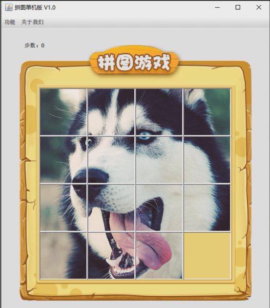
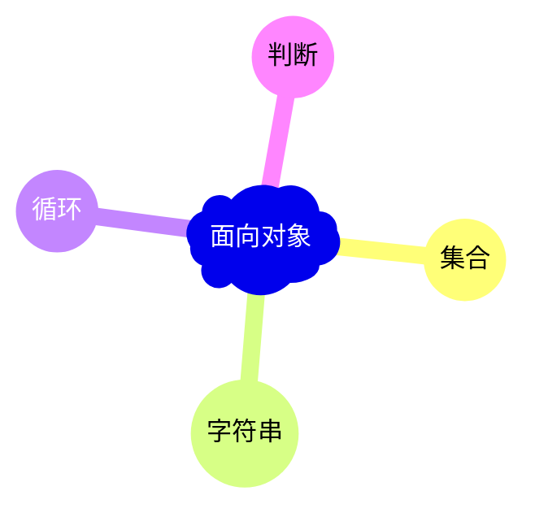

> 就是为了整合面向对象相关的知识点，如：集合、字符串、循环、判断等。

# 第一章：图形化界面

## 1.1 概述

* 因为是`游戏`，所以需要使用到 Java 中`图形化界面`知识。

> [!NOTE]
>
> `图形化界面`的英文缩写是 `GUI`，全称是 Graphical User Interface（图形用户接口），即：采用图形化的方式显示操作界面。

## 1.2 Java 中的图形化界面技术

* 基本上所有的编程语言都包含 GUI 相关的知识点，Java 也不例外。

> [!NOTE]
>
> * ① Python 语言的 PyQt、PySide 等。
> * ② C++ 语言的 Qt、MFC（过时）等。
> * ③ JavaScript 语言的 Electron、ReactNative。
> * ④ ...

* 在 Java 中，有三套完整的 GUI 体系：`AWT`、`Swing`以及`JavaFX`。

> [!NOTE]
>
> * ① `AWT`最先出来的，有一点兼容性问题，有的时候，在显示中文的时候可能会出现乱码。
> * ② 虽然现在依然可以使用`Swing`，如：IDEA 就是基于`Swing`。
> * ③ 但是，`Swing`也已经出现了很长时间，可能不如现代 GUI 框架（JavaFX）那样时尚！！！

# 第二章：Java 的应用场景

## 2.1 概述

* Java 中的图形化界面知识在很多课程中都没有讲，是有原因的，就是因为 Java 语言主要应用于`后台服务器开发`。

## 2.2 服务器

* 当我们通过`手机`或`浏览器`看`小说`，只有当手机或电脑（浏览器）连上互联网，才可以通过`网络`将小说中的内容，从`服务器`传递给`手机`或`浏览器`，如下所示：

> [!NOTE]
>
> * ① 平时使用到的手机或浏览器，只是做了一个数据的展示而已！！！
> * ② 所有的业务逻辑（登录、注册或小说的内容等）都是服务器做的！！！

* 在实际生活中，用户并不会接触到真实的服务器，他只会接触到客户端（浏览器或手机等），如下所示：

* 而 Java 语言主要做的是面向后台的服务器开发，Java 语言很少会和用户直接接触；所以，Java 中图形化界面的相关知识点在企业中就很少使用到，如下所示：

> [!NOTE]
>
> 正是由于上述的原因，很多课程在设计的时候，就将 Java 中图形化界面相关的知识点去掉了。

# 第三章：拼图小游戏的目的

## 3.1 概述

* 图形化界面的知识真的一点用没有的，其实并非如此！！！
* 图形化界面可以将之前学习的相关知识点串起来。

## 3.2 目的

* 之前，我们在学习面向对象相关知识点，如：集合、字符串、循环、判断等，用的并不是很多；所以在我们头脑中，这些知识点都是非常零散的，如下所示：

* 所以，现在我们必须设计一个项目，目的就是：将之前学习到的知识点整合起来，在大脑中有一个系统的概念，如下所示：

> [!NOTE]
>
> * ① 如果现在我们不写这个项目，继续向后学习新的知识点，那么至少要学习 JavaWeb 相关技术，才会写到项目。
> * ② 到那个时候，我们学习的知识点就更多了，大脑中的知识点太多就会形成一团浆糊，写项目的时候就更乱了。
> * ③ 此时，趁知识点还不多，而且该学的都学习完毕了，就写一个先练练手！！！

* 之前写的学生管理系统（控制台版）并不能称为一个项目，只能称为一个综合案例而已，因为我们平常看到的一些软件或访问的网站，不管做什么业务，都有一个共同的特点：基本上用鼠标点一下，就会做对应的事情，如下所示：

> [!NOTE]
>
> 没有图形化界面实现不了：用户使用鼠标点击一下，网站或游戏等就会做对应的事情，这种感觉很直观！！！

* 综上所述：我们就是利用当前的这个小游戏，去看下之前学习的知识点，在实际项目中到底是怎么使用的。

> [!NOTE]
>
> 在游戏项目中，我们会使用到如下的知识点：
>
> * ① 面向对象：封装、继承、多态、抽象类、接口和内部类等。
> * ② 编程语言通用基础：集合、字符串、数组、循环、判断等。

> [!IMPORTANT]
>
> Java 中的图形化界面的相关知识，我们只是利用`其`作为载体，用来达到以下的目的（并不需要在上面花费太多时间）：
>
> * ① 锻炼逻辑思维能力。
> * ② 知道前面学习的知识点在实际开发中的应用场景。