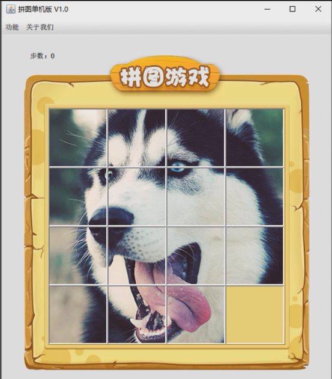

# 第一章：图形化界面

## 1.1 概述

* 因为是`游戏`，所以需要使用到 Java 中`图形化界面`知识。

> [!NOTE]
>
> `图形化界面`的英文缩写是 `GUI`，全称是 Graphical User Interface（图形用户接口），即：采用图形化的方式显示操作界面。

## 1.2 Java 中的图形化界面技术

* 基本上所有的编程语言都包含 GUI 相关的知识点，Java 也不例外。在 Java 中，有两套完整的体系：`AWT包`和 `Swing包`。

> [!NOTE]
>
> * ① `AWT包`最新出来的，有一点兼容性问题，有的时候，在显示中文的时候可能会出现乱码。
> * ② 虽然现在依然可以使用`Swing包`，如：IDEA 就是基于`Swing包`。
> * ③ 但是，`Swing包`也已经出现了很长时间，相对较老，可能不如现代 GUI 框架（JavaFX）那样时尚！！！

# 第二章：